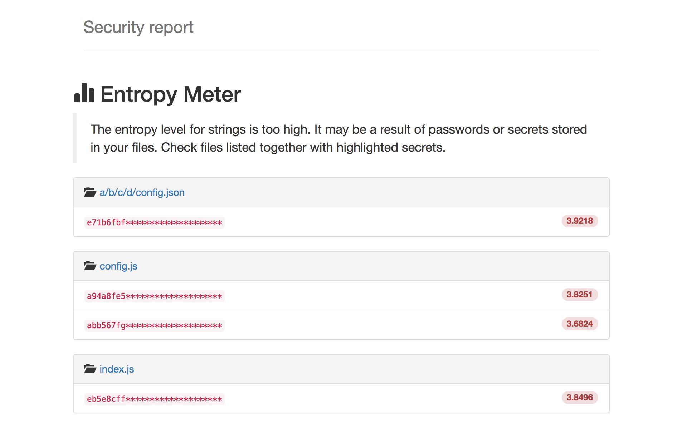
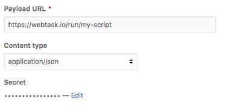

# Repo-supervisor

Serverless tool that detects secrets and passwords in your pull requests - one file at a time.

[](https://gitter.im/repo-supervisor/Lobby)
[](https://travis-ci.org/auth0/repo-supervisor)


<div style="text-align:center"></div>

## Command line mode

To start using tool without setting up webhooks etc. you can start scanning local directories right after downloading the source code:

```bash
npm install --no-optional
npm run build
npm run cli ./src/
```

**JSON output**

To trigger JSON format for the output report you need to set `JSON_OUTPUT=1` environment variable.

```bash
→ JSON_OUTPUT=1 node ./dist/cli.js ./test/fixtures/integration/dir.with.secrets/foo/ | jq
{
  "result": {
    "./test/fixtures/integration/dir.with.secrets/foo//bar.js": [
      "zJd-55qmsY6LD53CRTqnCr_g-",
      "gm5yb-hJWRoS7ZJTi_YUj_tbU",
      "GxC56B6x67anequGYNPsW_-TL",
      "MLTk-BuGS8s6Tx9iK5zaL8a_W",
      "2g877BA_TsE-WoPoWrjHah9ta"
    ],
    "./test/fixtures/integration/dir.with.secrets/foo//foo.json": [
      "d7kyociU24P9hJ_sYVkqzo-kE",
      "q28Wt3nAmLt_3NGpqi2qz-jQ7"
    ]
  }
}
```

## Docker

It's possible to run Repo Supervisor inside the Docker container. It gives you more flexibility and you don't need to configure your local environment with Node.JS and npm. At first you need to build up the Docker image:

```bash
docker build -t repo-supervisor .
```

To run the tool inside Docker container you need to trigger a specific command:

```bash
docker run -it --rm -v /local/path/on/your/host:/opt/scan_me repo-supervisor /bin/bash -c "source ~/.bashrc && JSON_OUTPUT=1 node /opt/repo-supervisor/dist/cli.js /opt/scan_me"
```

As a result it should return detected secrets in JSON format:

```
→ docker run -it --rm -v /local/path/on/your/host:/opt/scan_me repo-supervisor /bin/bash -c "source ~/.bashrc && JSON_OUTPUT=1 node /opt/repo-supervisor/dist/cli.js /opt/scan_me"
{"result":{"/opt/scan_me/bar.js":["zJd-55qmsY6LD53CRTqnCr_g-","gm5yb-hJWRoS7ZJTi_YUj_tbU","GxC56B6x67anequGYNPsW_-TL","MLTk-BuGS8s6Tx9iK5zaL8a_W","2g877BA_TsE-WoPoWrjHah9ta"],"/opt/scan_me/foo.json":["d7kyociU24P9hJ_sYVkqzo-kE","q28Wt3nAmLt_3NGpqi2qz-jQ7"]}}
```

## Setup

The recommended way is to clone this repository, install required dependencies and run script to deploy a script on the webtask.io platform.

```bash
 git clone git@github.com:auth0/repo-supervisor.git
 cd repo-supervisor

 npm install
 GITHUB_TOKEN=<token> JWT_SECRET=<secret> npm run deploy
```

After script was deployed it will return a URL address to your webtask which then you can use to setup a webhook.

_If you want to deploy webtask with profile different than a standard one you should set env. variable called `WT_PROFILE=myprofile` just before or right after `GITHUB_TOKEN` variable._

## Webhook

Installing webhook is easy and there is no difference to other webhooks provided by i.e. Zapier or IFTTT.

Before installing a webhook you need to build and install this tool. As a result `npm run deploy` should return the URL address to your deployed webtask. Point your **Payload URL** to webtask url and you're ready to go.

<div style="text-align:center"></div>

> Which events would you like to trigger this webhook?

- [x] Let me select individual events.
- [x] Pull request

## Requirements

After installing all required packages with `npm` the one additional tool is `wt-cli` to communicate with [webtask.io](https://webtask.io).

If you don't have an account then create a new one, **it's free**. All details related to `wt-cli` are available in the [documentation](https://webtask.io/docs/wt-cli).

Installation process:

```bash
npm install -g wt-cli
```

## Introduction

It happens sometimes that you can commit secrets or passwords to your repository by accident. The recommended best practice is not commit the secrets, that's obvious. But not always that obvious when you have a big merge waiting to be reviewed.

This tool allows you to setup a `webhook` that waits for the Pull Requests and scans all interesting files to check for leaked secrets. Every time PR is updated it rescans latest changes and generates a report.

Both acknowledge and rejection actions are triggering Slack notification which allows to whether improve or fix secrets detection rules.

**Acknowledge** report (YES): Approve that report as valid, detected strings are actual secrets.

**Reject** report (NO): Reject report, detected secrets are not credentials but only object identifiers, messages or other not related strings. It will help to improve the false-positives ratio.


## Security checks

Tool is easily extendable by adding new filter and parsers for a specific format, for now we support `json` and `js` parsing.

- **Entropy Meter** - measures the level of entropy for extracted strings. The higher the entropy the higher probability of detecting a secret/password.

## Testing

Testing this tool is super easy without a need to install the actual source code on the webtask platform.

1\. Start local wt-cli server

```bash
 cd repo-supervisor
 GITHUB_TOKEN=<github_token> JWT_SECRET=<random_secret> npm start
```

It will trigger the built-in server and listen by default at `localhost` on port `7070` if not changed (env: `PORT`, `HOST`).

2\. Run local `ngrok` tunnel

```bash
ngrok http 7070
```

Output:

```bash
Session Status                online
Region                        United States (us)
Web Interface                 http://127.0.0.1:4040
Forwarding                    http://b1942011.ngrok.io -> localhost:7070
Forwarding                    https://b1942011.ngrok.io -> localhost:7070
```

3\. Setup webhook URL so it points to `ngrok` URL.

[Ngrok](https://ngrok.com/) is a really useful tool, it allows you to inspect **every** request send to your ngrok's endpoint so you can verify data in/out.


## Dependencies

All required dependencies are enforced in specific versions on the webtask.io platform by using metadata setting.

```bash
--meta wt-node-dependencies=$(./bin/get.wt.deps.sh)
```

_get.wt.deps.sh_ script returns a list of dependencies extracted from `package.json` file.

```bash
→ ./bin/get.wt.deps.sh
{"acorn":"4.0.11","bluebird":"3.4.7","github":"8.2.1","handlebars":"4.0.6","handlebars-loader":"1.4.0","jsonwebtoken":"7.3.0","lodash":"4.17.4"}
```

Without the enforcement policy it would break the installation since older version of libraries are not compatible with current code.

## What is Auth0?

Auth0 helps you to:

* Add authentication with [multiple authentication sources](https://docs.auth0.com/identityproviders),
either social like **Google, Facebook, Microsoft Account, LinkedIn, GitHub, Twitter, Box, Salesforce,
amont others**, or enterprise identity systems like **Windows Azure AD, Google Apps, Active Directory,
ADFS or any SAML Identity Provider**.
* Add authentication through more traditional
**[username/password databases](https://docs.auth0.com/mysql-connection-tutorial)**.
* Add support for **[linking different user accounts](https://docs.auth0.com/link-accounts)** with
the same user.
* Support for generating signed [Json Web Tokens](https://docs.auth0.com/jwt) to call your APIs and
**flow the user identity** securely.
* Analytics of how, when and where users are logging in.
* Pull data from other sources and add it to the user profile, through
[JavaScript rules](https://docs.auth0.com/rules).

## Create a free account in Auth0

1. Go to [Auth0](https://auth0.com) and click Sign Up.
2. Use Google, GitHub or Microsoft Account to login.

## Issue Reporting

If you have found a bug or if you have a feature request, please report them at this repository
issues section. Please do not report security vulnerabilities on the public GitHub issue tracker.
The [Responsible Disclosure Program](https://auth0.com/whitehat) details the procedure for
disclosing security issues.

## Author

[Auth0](https://auth0.com)

## License

This project is licensed under the MIT license. See the [LICENSE](LICENSE) file for more info.
