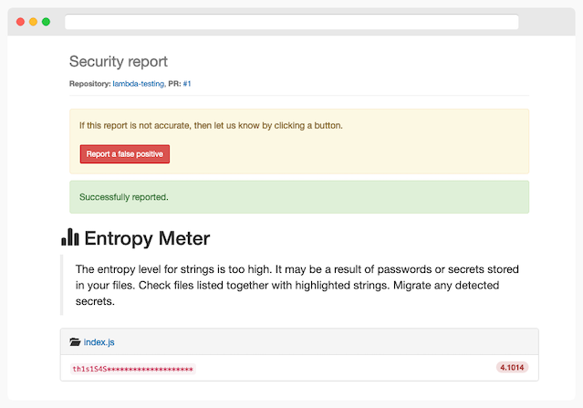

# Repo-supervisor

[](https://gitter.im/repo-supervisor/Lobby)
[](https://travis-ci.org/auth0/repo-supervisor)


The Repo-supervisor is a tool that helps you to detect secrets and passwords in your code. It's as easy to install as adding a new webhook to your Github repository.

It works in two separate modes. The first one allows us to scan Github pull requests, and the second one works from the command line where it scans local directories.

- [Repo-supervisor](#repo-supervisor)
  - [Usage](#usage)
    - [Pre-requisites](#pre-requisites)
    - [Command line mode](#command-line-mode)
    - [Github Pull Request mode](#github-pull-request-mode)
  - [Supported files](#supported-files)
  - [Security checks](#security-checks)
  - [Frequently asked questions](#frequently-asked-questions)
    - [How does it work?](#how-does-it-work)
    - [Why doesn't it find any secrets?](#why-doesnt-it-find-any-secrets)
    - [How to add support for new file types?](#how-to-add-support-for-new-file-types)
  - [What is Auth0?](#what-is-auth0)
    - [Create a free account in Auth0](#create-a-free-account-in-auth0)
  - [Issue Reporting](#issue-reporting)
  - [Author](#author)
  - [License](#license)

## Usage

### Pre-requisites

To start using a tool, download the latest release from the Github releases page. There are two bundles available for both AWS Lambda deployment as well as for the CLI mode. Using CLI mode doesn't require any additional configuration, whereas to use the PR mode, it's necessary to deploy the bundle to AWS Lambda first.

- [AWS Lambda deployment](docs/aws.lambda.deployment.md)
- [Using a docker image](docs/docker.image.md)

### Command line mode

The CLI mode allows scanning local directories with source code to detect secrets and passwords in files. That is the simplest deployment option, and it could become a part of the CI pipeline.

Findings might be either returned in the plaintext or JSON format:

```bash
$ npm ci && npm run build
$ node ./dist/cli.js ./test/fixtures/integration/dir.with.secrets

[./test/fixtures/integration/dir.with.secrets/foo/bar.js]
>> zJd-55qmsY6LD53CRTqnCr_g-
>> gm5yb-hJWRoS7ZJTi_YUj_tbU
>> GxC56B6x67anequGYNPsW_-TL
>> MLTk-BuGS8s6Tx9iK5zaL8a_W
>> 2g877BA_TsE-WoPoWrjHah9ta

[./test/fixtures/integration/dir.with.secrets/foo/foo.json]
>> d7kyociU24P9hJ_sYVkqzo-kE
>> q28Wt3nAmLt_3NGpqi2qz-jQ7

$ JSON_OUTPUT=1 node ./dist/cli.js ./test/fixtures/integration/dir.with.secrets

{"result":[{"filepath":"./test/fixtures/integration/dir.with.secrets/foo/bar.js","secrets":["zJd-55qmsY6LD53CRTqnCr_g-","gm5yb-hJWRoS7ZJTi_YUj_tbU","GxC56B6x67anequGYNPsW_-TL","MLTk-BuGS8s6Tx9iK5zaL8a_W","2g877BA_TsE-WoPoWrjHah9ta"]},{"filepath":"./test/fixtures/integration/dir.with.secrets/foo/foo.json","secrets":["d7kyociU24P9hJ_sYVkqzo-kE","q28Wt3nAmLt_3NGpqi2qz-jQ7"]}]}
```


### Github Pull Request mode

Running a tool in the pull request mode requires to add a new webhook to the Github repository. Webhook should be triggered on a pull request events whenever someone opens, updates, or closes a PR. Therefore, when a scan is triggered, it will update the PR status to either success or failure, depending on findings.

Webhook configuration details:

| Setting      | Value              |
| ------------ | ------------------ |
| Payload URL  | AWS Lambda URL     |
| Content type | `application/json` |
| Events type  | `Pull requests`    |

Whenever a tool finds security issues, it sets the PR status to error, and it adds a link to view the report. Link to the report is a URL to AWS Lambda deployment with an additional query parameter `?id=<jwt>` that allows to generate the HTML report.

Check out a sample report:

<div style="text-align:center"></div>

Depending on the success or failure of the scan, it will set a proper PR status.

**Error - issues detected**


**Success - no issues were found**


**A false positive was reported**


## Supported files

Repo-supervisor aims to decrease the number of false positives as much as possible. It means that it doesn't scan all file types and extensions. Each file is parsed according to its format to extract strings, and this is a context-aware process that requires to use a language tokenizer. The currently supported file types are:

- JSON (.json)
- JavaScript (.js)
- YAML (.yaml)

We plan to add new file types in the future. Read a documentation on [how to add a new file type](docs/add.new.file.type.md) to learn more.

## Security checks

This is the list of currently implemented checks in a tool:

| Module            | Details                                                                                    |
| ----------------- | ------------------------------------------------------------------------------------------ |
| **Entropy Meter** | Finds strings with a high entropy to detect secrets and passwords in supported file types. |

## Frequently asked questions

### How does it work?

**CLI mode:**

- Scan a directory provided as argument
- Get a list of all files and return only those matching [supported extensions](#supported-files) like `*.json` or `*.js`
- Process every supported file with a tokenizer (different one for each file type)
- Iterate over all extracted strings and run security checks on them
  - Entropy Meter - calculate the entropy value to see if it goes above defined threshold ([maxAllowedEntropy](config/filters/entropy.meter.json))
- Print out detected issues either in a plain-text or JSON format

**Pull Request mode:**

- Receive a webhook payload
- Process payload and extract all modified files
- Iterate over each file:
  - Use the appropriate tokenizer based on file type
  - Extract strings from a file
  - Run security checks on those strings
- If tool detects issues then it sets CI status to error with a link to the report
- If no issues were found then it sets CI status to success

Read more on the [CI status](https://developer.github.com/v3/repos/statuses/) definition.

### Why doesn't it find any secrets?

Verify that the secrets you want to find are inside supported file types. Read more in the [Supported files](#supported-files) section.

### How to add support for new file types?

To support a new file type, you need to create a new parser. Some of the file types might require to use external tokenizers because of the complex structure like [JavaScript](src/parser/tokenizer/js/index.js) files. On the other hand, for simple file types, it's pretty straightforward as it was with [JSON](src/parser/tokenizer/json/index.js) files.

Read more on how to add a [new file type](docs/add.new.file.type.md).

---

## What is Auth0?

Auth0 helps you to:

* Add authentication with [multiple authentication sources](https://docs.auth0.com/identityproviders),
either social like **Google, Facebook, Microsoft Account, LinkedIn, GitHub, Twitter, Box, Salesforce,
amont others**, or enterprise identity systems like **Windows Azure AD, Google Apps, Active Directory,
ADFS or any SAML Identity Provider**.
* Add authentication through more traditional
**[username/password databases](https://docs.auth0.com/mysql-connection-tutorial)**.
* Add support for **[linking different user accounts](https://docs.auth0.com/link-accounts)** with
the same user.
* Support for generating signed [Json Web Tokens](https://docs.auth0.com/jwt) to call your APIs and
**flow the user identity** securely.
* Analytics of how, when and where users are logging in.
* Pull data from other sources and add it to the user profile, through
[JavaScript rules](https://docs.auth0.com/rules).

### Create a free account in Auth0

1. Go to [Auth0](https://auth0.com) and click Sign Up.
2. Use Google, GitHub or Microsoft Account to login.

## Issue Reporting

If you have found a bug or if you have a feature request, please report them at this repository
issues section. Please do not report security vulnerabilities on the public GitHub issue tracker.
The [Responsible Disclosure Program](https://auth0.com/whitehat) details the procedure for
disclosing security issues.

## Author

[Auth0](https://auth0.com)

## License

This project is licensed under the MIT license. See the [LICENSE](LICENSE) file for more info.
